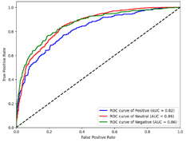

# LSTM-FinBERT-Adversarial：面向保险新闻的自适应情感分析模型

本项目的启发点是在再保公司实习期间，发现客户经理每天会花数小时人工浏览全球新闻，主题围绕巨灾、气候、政治等可能导致大规模理赔和有承保需要的新闻热点，而捕捉高价值新闻文本是效率突破口，因此开发出这个模型，平均每分钟可对900余条保险新闻文本进行情感识别。

作为作者论文的实现部分，项目目的是开发一种面向保险行业文本的情感分析模型：**LSTM-FinBERT-Adversarial 融合模型**。该模型结合了金融领域预训练语言模型 FinBERT、时序建模能力强的 LSTM，以及对抗训练机制（FGSM），提升模型在小样本及长文本场景下的鲁棒性和精度，适用于保险舆情监测与风险预警任务。

---

## 项目亮点

- **FinBERT + LSTM 融合结构**：兼顾语义理解和时序建模；
- **引入对抗训练（FGSM）**：提升少数类（积极/消极）文本的识别能力；
- **适配保险语境**：通过行业语料微调优化模型表现；
- **多模型对比实验**：与 FinBERT、LSTM、融合模型等进行系统评估。

---

## 代码结构
```
LSTM-FinBERT-Adversarial/
├── code/
│ ├── crawling_the_news_text.ipynb # 新闻爬虫
│ ├── preprocessing_lstm_and_finbert.ipynb# 数据预处理和LSTM 与 FinBERT 特征提取
│ ├── fusion_model.ipynb # LSTM + FinBERT 融合模型训练
│ ├── fusion_adversarial_model.ipynb # 引入 FGSM 对抗训练后的最终模型
│
├── raw_data/
│ ├── news_all.csv # 保险+金融新闻文本
│ 
├── output/
│ ├── model_weights/ # 保存训练好的模型参数
│
├── requirements.txt # 项目依赖
└── README.md # 项目说明（当前文件）
```
---
## 模型结构
### FinBERT模块

### LSTM模块

### Dense层

### Dropout层架构图

### FGSM对抗训练流程图


---

## 量化评价

### 不分样本类别

| 类别           | 模型                           | 准确率 | 加权平均精确率 | 加权平均召回率 | 加权平均 F1 分数 |
|--------------|------------------------------|-----|---------|---------|------------|
| **传统机器学习模型** | TF-IDF - 逻辑回归                | 79% | 79%     | 79%     | 77%        |
|              | TF-IDF - 逻辑回归 - SMOTE        | 78% | 80%     | 78%     | 79%        |
| **深度学习模型**   | LSTM                         | 75% | 74%     | 75%     | 74%        |
|              | FinBERT                      | 73% | 90%     | 73%     | 77%        |
|              | LSTM - FinBERT               | 84% | 83%     | 84%     | 84%        |
|              | LSTM - FinBERT - Adversarial | 84% | 85%     | 84%     | 84%        |

### 区分样本类别
FinBERT-LSTM Model

| 类别           | Precision | Recall | F1-score |
|--------------|-----------|--------|----------|
| **Positive** | 0.51      | 0.49   | 0.50     |
| **Negative** | 0.64      | 0.61   | 0.63     |

FinBERT-LSTM-Adversarial Model

| 类别           | Precision | Recall | F1-score |
|--------------|-----------|--------|----------|
| **Positive** | 0.79      | 0.55   | 0.65     |
| **Negative** | 0.77      | 0.60   | 0.67     |

### 混淆矩阵
LSTM



FinBERT


FinBERT-LSTM


FinBERT-LSTM-Adversarial


### ROC-AUC曲线

LSTM


FinBERT


FinBERT-LSTM


FinBERT-LSTM-Adversarial


FinBERT-LSTM-Adversarial最圆滑，且三个类别的曲线最近距，说明模型在低假阳率处的真阳率进一步提升，即模型的分类置信度增强，且不同类别中分类性能稳定。在其他分类准确性不降低的情况下，Negative 类别的 AUC 提升至 0.94，表明对抗训练不仅优化了少数类别，还增强了全局分类能力（F1分数最高）。